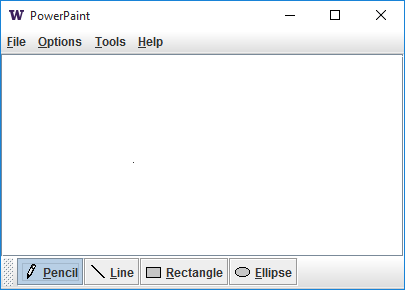

# Power Paint
### TCSS 305 Programming Prcticum

A simple graphical program for painting.

### Objectives
* Write a graphical programm in Java.
* Utilite Swing components
* Implement 2D graphics, mouse events, and some other Swing components.

### Example

